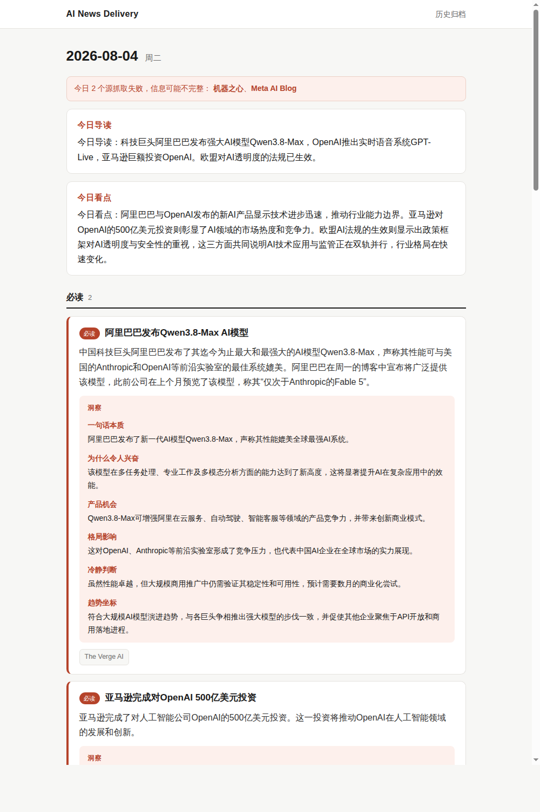
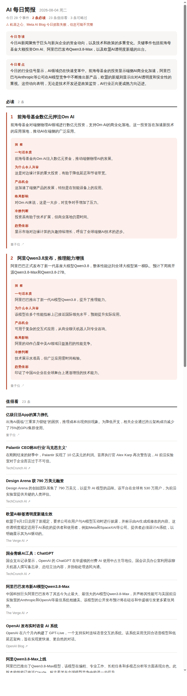

# AI News Delivery

[](https://github.com/PeiyanLai/AI-News-Delivery/actions/workflows/daily.yml)
[](LICENSE)

**每天 5 分钟掌握 AI 领域大事。** 全自动流水线：抓取 10+ 个中英文 AI 资讯源 → 按事件聚合去重 → LLM 生成中文摘要与重要性分级 → 产品经理视角的六维度洞察卡片 → 静态 Dashboard + 每日邮件送达。零服务器成本，每月 LLM 开销约 1-2 美元。

### 🔗 在线体验

**Dashboard：<https://peiyanlai.github.io/AI-News-Delivery/>**

每天北京时间早 7:00 自动更新，支持回看任意历史日期。数据、代码、每日运行记录全部公开在本仓库中（[Actions](https://github.com/PeiyanLai/AI-News-Delivery/actions) 可见每次运行日志）。

| Dashboard | 每日邮件 |
|:---:|:---:|
|  |  |

## 核心设计

**事件聚合，而非文章列表。** 同一个新闻事件往往被多家媒体各写一篇。系统用 embedding 相似度把多篇报道聚合成一个"事件"，你看到的是"今天发生了 12 件事"，而不是"今天有 47 篇文章"，每个事件下挂所有来源的原文链接。

**分级对抗信息过载。** 每个事件由强模型标记 必读 / 值得看 / 可略过，prompt 中用硬约束防止分级坍缩（"全标值得看等于没有分级，是失败的输出"）。

**洞察卡片：不止于摘要。** 当日必读事件生成六维度分析——一句话本质、为什么令人兴奋、产品机会、格局影响、冷静判断（Hype Check）、趋势坐标。其中"趋势坐标"会读取最近 14 天的事件档案，判断当日事件与趋势线的呼应关系。六个维度定义在 [prompt 模板](config/prompts/daily_analysis.md)中，改配置即可增删。

**成本工程。** 分层用模型：批量任务（逐事件摘要、相关性过滤）用 gpt-4o-mini，每日一次的分级与洞察用 gpt-4o；洞察卡片只给必读事件。单日全流水线约 1.5 万 tokens，折合每天几美分。

**为失败而设计。** 每个信息源是独立适配器，单源失败不阻塞流水线，当日 Dashboard 和邮件明确标注"某某源今日抓取失败"；LLM 相关性过滤失败时降级为全部保留；embedding 失败时降级为每篇文章一个事件。

## 架构

```
GitHub Actions（每日 07:00 北京时间，cron 触发）
   └─ python -m pipeline.main run
        抓取（RSS / HN Algolia API / 网页解析，可插拔适配器）
        → 跨天去重（seen-url 记录）
        → LLM 相关性过滤（剔除非 AI 内容，官方源豁免）
        → 事件聚合（embedding 余弦相似度贪心聚类）
        → 逐事件中文摘要（fast model）
        → 分级 + 洞察卡片 + 今日导读/看点（smart model，带 14 天档案上下文）
        → data/YYYY-MM-DD.json（事件档案，git 版本化，天然可回溯）
        → docs/（静态 Dashboard，GitHub Pages 托管）
        → 每日邮件（SMTP / Resend，全量内容无需跳转）
```

技术栈：Python（标准库 + feedparser/BeautifulSoup/Jinja2）· OpenAI API · GitHub Actions · GitHub Pages。无数据库、无服务器：事件数据以 JSON 存仓库，既是存储也是版本历史。

## 部署自己的实例

Fork 本仓库后三步上线：

1. **配置 Secrets**：仓库 Settings → Secrets and variables → Actions，添加
   - `OPENAI_API_KEY`（必需）
   - 邮件（可选，不配则跳过）：SMTP 方式加 `SMTP_USER`（完整邮箱地址）和 `SMTP_PASS`（邮箱的 SMTP 授权码，不是登录密码）；或改用 Resend（`config/settings.yaml` 里 `email.provider: resend`）加 `RESEND_API_KEY`
2. **启用 GitHub Pages**：Settings → Pages → Source 选 `Deploy from a branch`，分支选默认分支的 `/docs` 目录。部署后把地址填入 `config/settings.yaml` 的 `site.base_url`
3. **手动触发一次**：Actions → Daily AI briefing → Run workflow，验证全链路。之后每天自动运行

## 本地运行

```bash
pip install -r requirements.txt

# 无需任何 key 的端到端演示（示例数据 + mock LLM）
python -m pipeline.main run --mock --fixtures pipeline/fixtures/sample_articles.json --no-email

# 真实抓取 + mock LLM（验证各源可达性）
python -m pipeline.main run --mock --no-email

# 完整运行
export OPENAI_API_KEY=sk-...
python -m pipeline.main run
```

生成结果：`data/<日期>.json`（数据）与 `docs/`（网站，浏览器直接打开 `docs/index.html`）。

## 配置说明

| 文件 | 用途 |
|------|------|
| `config/settings.yaml` | 模型选择、聚类阈值、关注方向、洞察卡片上限、邮件收件人等 |
| `config/sources.yaml` | 信息源清单；加一个 RSS 源只需加一段配置，`enabled: false` 可停用 |
| `config/prompts/event_summary.md` | 事件摘要 prompt（fast model） |
| `config/prompts/daily_analysis.md` | 分级标准与洞察卡片六维度定义（smart model） |
| `config/prompts/relevance_filter.md` | 相关性过滤 prompt（fast model） |

需求与设计决策的完整记录见 [REQUIREMENTS.md](REQUIREMENTS.md)。

## 已知限制

- 中文媒体源依赖其 RSS 端点，防爬网关可能拦截 CI 服务器 IP（失败会在当日报告中标注）
- 摘要基于 RSS 提供的正文/摘要，不抓全文
- 事件聚合目前仅用 embedding 阈值，跨语言的同事件合并（中英文报道同一件事）计划引入 LLM 二次确认

## License

[MIT](LICENSE)
